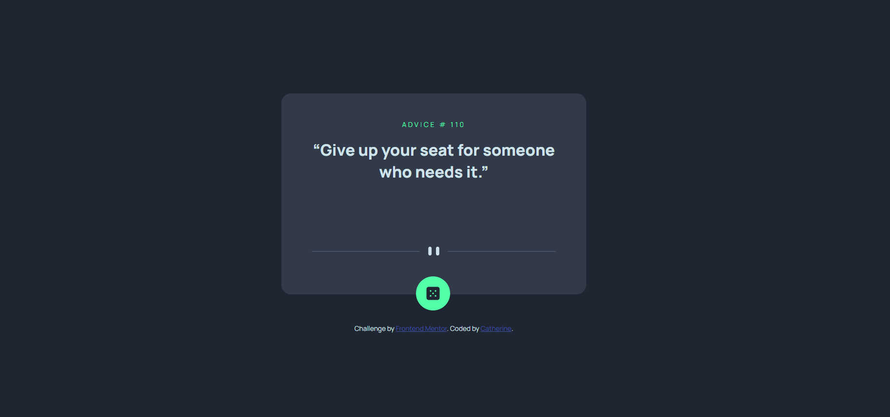
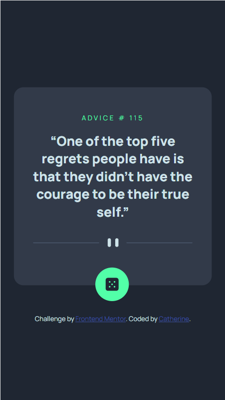

# Advice generator app solution

This is a solution to the [Advice generator app challenge on Frontend Mentor](https://www.frontendmentor.io/challenges/advice-generator-app-QdUG-13db). Frontend Mentor challenges help you improve your coding skills by building realistic projects.

## Table of contents

- [Overview](#overview)
  - [The challenge](#the-challenge)
  - [Screenshot](#screenshot)
  - [Links](#links)
- [My process](#my-process)
  - [Built with](#built-with)
  - [What I learned](#what-i-learned)
  - [Continued development](#continued-development)
  - [Useful resources](#useful-resources)
- [Author](#author)

## Overview

### The challenge

Users should be able to:

- View the optimal layout for the app depending on their device's screen size
- See hover states for all interactive elements on the page
- Generate a new piece of advice by clicking the dice icon

### Screenshot

### Links

- Solution URL: [Git Repository](https://github.com/boba-milktea/advice-generator.git)
- Live Site URL: [Git Page](https://boba-milktea.github.io/advice-generator/)

## My process

### Built with

- Semantic HTML5 markup 
- CSS custom properties
- Flexbox
- Mobile-first workflow

### What I learned

Through this project, I have practiced [Axios](https://axios-http.com/docs/intro), a promised based HTTP client for node.js and the browser, the Async function. And how to scale a text to fit inside an element. 

### Continued development

I am not sure I used correctly Axios and the async function. 
The page is working in Chrome but not responding in firefox after the first request. 
Some advice contains spcial charactors that can't be present correctly. There must be a solution for this. 

### Useful resources

- [Text Scaling](https://htmldom.dev/scale-a-text-to-fit-inside-of-an-element/) - Some advice has too much text that may cross the divider, this site helps me to fit the text inside the container. 

## Author

- Frontend Mentor - [@nitty-kitty](https://www.frontendmentor.io/profile/nitty-kitty)

